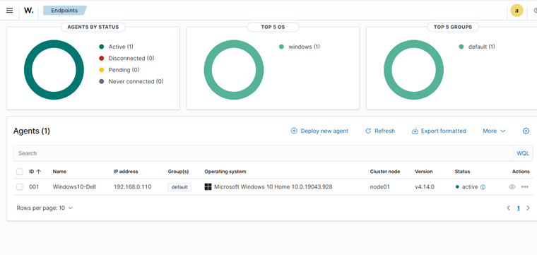
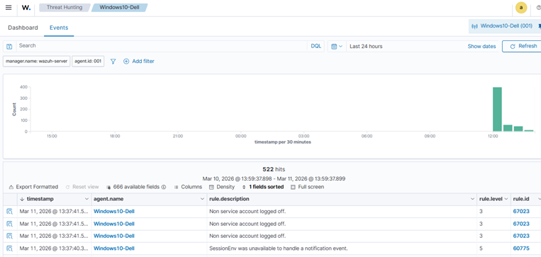
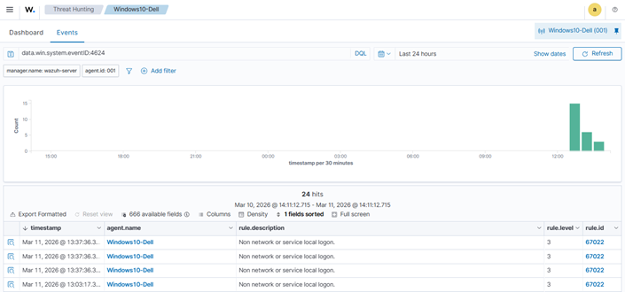

# SOC Lab – Task 1: SIEM Deployment & Log Collection

**Author:** Afaq Ali
**Project:** Security Operations Center (SOC) Lab
**Technology Used:** Wazuh SIEM, VMware, Windows Agent

---

# Objective

Deploy a Security Information and Event Management (SIEM) solution using **Wazuh**, integrate a **Windows endpoint agent**, and monitor collected system logs through the centralized dashboard.

---

# Lab Environment

| Component            | Description         |
| -------------------- | ------------------- |
| SIEM Platform        | Wazuh               |
| Virtualization       | VMware              |
| Agent System         | Windows             |
| Monitoring Interface | Wazuh Web Dashboard |

---

# SIEM Deployment

The **Wazuh SIEM platform** was deployed inside a virtual machine environment using VMware. After installation, the platform was accessed through the Wazuh web dashboard via the server IP address.

Example access URL:

```
https://192.168.0.109
```

### Wazuh Components Deployed

* **Wazuh Manager** – processes and analyzes incoming security logs
* **Wazuh Dashboard** – web interface used for monitoring events
* **Indexer** – stores and organizes collected log data

These components provide centralized visibility of security events across monitored systems.

Reference Documentation:
https://documentation.wazuh.com/current/deployment-options/virtual-machine/virtual-machine.html

---

# Endpoint Agent Configuration

A **Wazuh agent** was installed on a Windows machine to enable log collection.

After configuration, the agent successfully established communication with the Wazuh server and began forwarding Windows event logs.

### Logs Collected

* Application logs
* Security logs
* System logs

The Windows endpoint appeared in the **Agents section** of the Wazuh dashboard with status **Active**, confirming successful integration.

---

# Security Event Generation

To generate sample security telemetry, several activities were performed on the Windows system, including:

* User logon and logoff events
* Failed authentication attempts
* Command-line activity

These actions generated **Windows Event Logs**, which were automatically forwarded to the Wazuh SIEM for analysis.

---

# Log Monitoring & Threat Analysis

Collected logs were analyzed through the **Threat Hunting → Events** section of the Wazuh dashboard.

The event viewer provided detailed telemetry including:

* Event timestamp
* Endpoint agent name
* Detection rule triggered
* Severity classification

Additional filtering was applied to identify **authentication failures and login-related events**.

---

# Dashboard & Log Monitoring Screenshots

## Wazuh Login Page


## Wazuh Dashboard Home


## Agents Page – Windows Agent Active



## Threat Hunting Events



## Authentication Failure Filter


## Logon Event Logs



## Logoff Event Logs


---

# Results

The SIEM deployment successfully:

* Integrated a Windows endpoint with the Wazuh platform
* Collected and centralized Windows event logs
* Detected authentication-related events
* Enabled real-time monitoring through the Wazuh dashboard

---

# Conclusion

This lab successfully demonstrated the deployment of a **Wazuh-based SIEM monitoring environment** and the integration of a Windows endpoint for centralized log collection.

The platform provided visibility into system activity and authentication events, enabling effective monitoring and analysis through the Wazuh dashboard.
