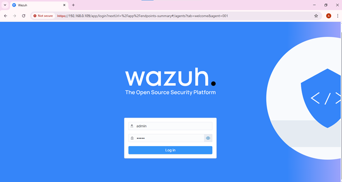
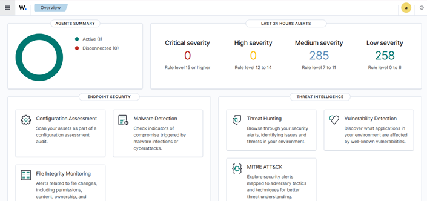
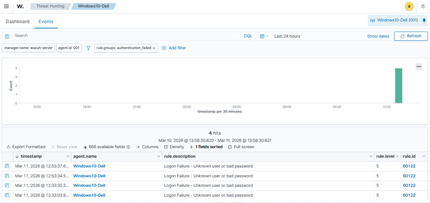
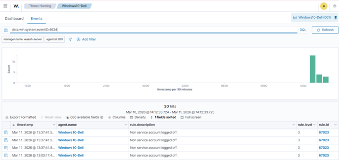

# SOC Lab – Wazuh SIEM Deployment & Log Monitoring

**Author:** Afaq Ali
**Project:** SOC Lab – SIEM Deployment
**Tools:** Wazuh, VMware, Windows Agent

---

# Lab Demonstration

## Wazuh Login Interface



## Wazuh Dashboard Overview



## Endpoint Agent Status


## Threat Hunting Events View


## Authentication Failure Filter



## Logon Event Logs


## Logoff Event Logs



---

# Objective

Deploy a SIEM solution using **Wazuh**, integrate a **Windows endpoint agent**, and monitor collected security logs through a centralized dashboard.

---

# Lab Environment

| Component            | Description         |
| -------------------- | ------------------- |
| SIEM Platform        | Wazuh               |
| Virtualization       | VMware              |
| Endpoint System      | Windows             |
| Monitoring Interface | Wazuh Web Dashboard |

---

# SIEM Deployment

The **Wazuh SIEM platform** was deployed inside a VMware virtual machine environment. After installation, the Wazuh dashboard was accessed through a browser using the server IP address.

Example access URL:

```
https://192.168.0.109
```

### Core Components

* **Wazuh Manager** – processes incoming security logs
* **Wazuh Dashboard** – visual monitoring interface
* **Indexer** – stores and organizes event data

---

# Endpoint Agent Integration

A **Wazuh agent** was installed on a Windows machine to enable centralized log collection.

After installation, the agent connected successfully to the Wazuh server and began forwarding Windows event logs.

### Logs Collected

* Application logs
* Security logs
* System logs

The endpoint appeared in the **Agents section** of the dashboard with status **Active**, confirming successful integration.

---

# Security Event Monitoring

Security activities such as **user logins, failed authentication attempts, and command-line actions** were generated on the Windows system to produce event logs.

These logs were automatically forwarded to the Wazuh server and analyzed through the **Threat Hunting → Events** dashboard.

The platform displayed detailed telemetry including:

* Event timestamp
* Agent name
* Detection rule triggered
* Severity classification

---

# Results

The SIEM deployment successfully:

* Integrated a Windows endpoint with Wazuh
* Centralized Windows event log collection
* Detected authentication-related events
* Enabled real-time monitoring via the dashboard

---

# Conclusion

This lab demonstrates the deployment of a **Wazuh-based SIEM monitoring environment** and the successful integration of a Windows endpoint for centralized log collection and event analysis.
